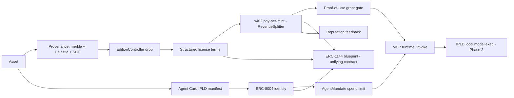

# Licensed Runtime Asset Roadmap (LR0 — Overview)

> **Status legend:** ✅ done · 🚧 in progress · ⬜ not started
>
> This roadmap reconciles the example `PROJECT-BRIEF.md` (an ERC-8004 + x402
> "migration" spec) with what JoyCreate **already has deployed and built**, then
> fuses the two into a single primitive: the **Licensed Runtime Asset**.
>
> The brief assumed a greenfield migration. In reality JoyCreate already ships
> ~80% of it on Arbitrum Sepolia — with different contract addresses and
> interfaces than the brief guessed. These docs are the source of truth; the
> brief is a *format/intent reference only*.

---

## The core idea — Licensed Runtime Asset

Every asset carries **two layers**, unified by the existing ERC-1144 blueprint
([interface_broker.ts](../../src/lib/onchain/interface_broker.ts)) and bound to an
ERC-8004 identity:

- **Licensing layer** (what you may do + how you pay): provenance (merkle +
  Celestia DA + DataProvenance SBT) → `EditionController` drop keyed by the
  content leaf → structured license terms → x402 pay-per-mint (RevenueSplitter
  80/10/10) → Proof-of-Use grant gate → ValidationRegistry integrity → reputation
  feedback.
- **Runtime layer** (how the asset executes): agent-card IPLD manifest
  (`modelConfig` / `systemPrompt` / `toolsSchema` / `skillCID`) → ERC-8004
  identity binding → AgentMandate delegated spend → MCP invocation → (Phase 2)
  IPLD local model execution.

The brief contributes the *agent-card-as-runtime-manifest* shape and structured
license/fee thinking; JoyCreate contributes the deployed stack, the ERC-1144
broker, provenance/DA, AgentMandate, and a live MCP server.

---

> ⚠️ **A third, live production stack exists** — the cloud Joy Marketplace —
> with **different addresses and ABIs** than the JoyCreate-local config below.
> See [LR-CLOUD-contract-inventory.md](LR-CLOUD-contract-inventory.md).
> **Fork resolved (2026-06-11): keep the local Stylus stack** (below) as
> canonical; reach the cloud stack via the ERC-1144 blueprint. **Adopt the
> cloud's gasless EIP-3009 relayer model** for purchase settlement.

## Deployed contracts (Arbitrum Sepolia — JoyCreate-local Stylus config)

All `arbitrumOne` addresses are currently `ZERO_ADDRESS` (mainnet not live → LR7).

| Concern | Contract | Address | Config |
|---|---|---|---|
| Identity | IdentityRegistry | `0x2168a88e613cd28409335eaa98e8aeed78d2e2ec` | [erc8004.ts](../../src/config/erc8004.ts) |
| Reputation | ReputationRegistry | `0x82718a9325ee5322cab83d5b7ee4ed060c19a626` | [erc8004.ts](../../src/config/erc8004.ts) |
| Validation | ValidationRegistry | `0x9edcbf7f396dddb6e793b472661610772c7d68a6` | [erc8004.ts](../../src/config/erc8004.ts) |
| Store | StoreRegistry | `0x2e6f02271ae08250d2c87f4fa02eb468f4abe3e4` | [glue.ts](../../src/config/glue.ts) |
| Capability | EditionController | `0x93b334ce8043195d57259c55ca2b336e63c17255` | [glue.ts](../../src/config/glue.ts) |
| Delegation | AgentMandate | `0xe326ec664c22ac6adde0215e619fe8aece669408` | [glue.ts](../../src/config/glue.ts) |
| Payment | RevenueSplitter (80/10/10) | `0x34fa204ca5db1a25a0003b1c7b45ab9c858d63bf` | [x402.ts](../../src/config/x402.ts) |
| USDC (Arb Sep, EIP-3009) | USDC | `0x75faf114eafb1BDbe2F0316DF893fd58CE46AA4d` | [x402.ts](../../src/config/x402.ts) |

---

## Reconciliation — brief assumption vs. JoyCreate reality

| Brief says | JoyCreate reality |
|---|---|
| FIFSRegistrar (no ENS) | No FIFSRegistrar. `StoreRegistry(slug, agentId)` **+** ENS `.joy` (BaseRegistrar / JoyCreatorGate / JoyResolver) |
| Identity `0x8004A169…` `mint(addr, agentCardURI)` | Deployed `0x2168a88e…` `newAgent(bytes agentDomain, address)` — different address **and** ABI |
| Reputation `0x8004BAa1…` `submitFeedback(id, score, uri)` | Deployed `0x82718a93…` `acceptFeedback` / `submitFeedback(clientId, serverId, score, bytes)` / `averageScore` |
| Validation = agent authorization (`authorize` / `isAuthorized`) | **Wrong.** Deployed Validation does `validationRequest` / `validationResponse(dataHash, score)`. Agent auth = **AgentMandate** (`createMandate` / `recordSpend`) + `StoreRegistry.setAgent` |
| EditionController = new | Already deployed `0x93b334…` (`createDrop` / `setActive` / `grantProof` / `mint`) |
| x402 = new; split owner + platform + DAO | Built. RevenueSplitter `0x34fa20…` is **80/10/10** creator / platform / protocol |
| MCP server = new | Built, port 3777 (`discover` / `purchase_execute` / `drop_launch`), auto-started in `main.ts` |
| Agent cards = IPFS CIDs | **Was** not built — `agentDomain` was a plain string. **LR1 closes this.** |

---

## The 7 gaps (the actual work)

1. **G1** — store creation never minted an ERC-8004 identity (`agentId` defaulted `"0"`). → **LR1 ✅**
2. **G2** — no agent-card builder/pinner; `agentDomain` not an IPLD CID. → **LR1 ✅**
3. **G3** — reputation *read* in blueprints but feedback never *submitted* post-purchase. → **LR3**
4. **G4** — no x402 fee on store registration (only edition purchases). → **LR6**
5. **G5** — MCP missing `store_register`, `agent_authorize`, `reputation_submit`, `license_check`, `runtime_invoke`. → **LR4/LR5**
6. **G6** — no subgraph for 8004/glue events; ENS `.joy` ↔ StoreRegistry slug not unified. → **LR6**
7. **G7** — mainnet not live (`arbitrumOne` = `ZERO_ADDRESS` in 5 configs). → **LR7**

---

## Milestones

| ID | Title | Closes | Status | Doc |
|---|---|---|---|---|
| LR1 | Identity + Agent-Card runtime manifest | G1, G2 | ✅ done | [LR1](LR1-identity-agent-card.md) |
| LR2 | Structured license terms | — | ⬜ | [LR2](LR2-structured-license.md) |
| LR3 | PoU + Validation + Reputation (license enforcement) | G3 | ⬜ | [LR3](LR3-pou-reputation-validation.md) |
| LR4 | AgentMandate runtime autonomy | (G5) | ⬜ | [LR4](LR4-agent-mandate-runtime.md) |
| LR5 | MCP runtime + licensing tool surface | G5 | ⬜ | [LR5](LR5-mcp-tool-surface.md) |
| LR6 | x402 store-reg fee + Goldsky subgraph + ENS↔slug unify | G4, G6 | ⬜ | [LR6](LR6-fee-subgraph-unify.md) |
| LR7 | Arbitrum One mainnet cutover + GA | G7 | ⬜ | [LR7](LR7-mainnet-cutover.md) |
| LR8 | Phase 2 — IPLD local model execution | — | ⬜ | [LR8](LR8-ipld-local-execution.md) |

---

## End-to-end flow (target)

---

## Cross-cutting conventions (apply to every milestone)

- Each milestone runs `npm run lint` (oxlint — the enforced linter; **not** Biome,
  whose `organizeImports` is informational), `npm run test` (Vitest), `npm run e2e`
  (Playwright).
- **New IPC channels require 4 edits** (see
  [.github/instructions/ipc-handlers.instructions.md](../../.github/instructions/ipc-handlers.instructions.md)):
  handler in `src/ipc/handlers/*` → registration in
  [ipc_host.ts](../../src/ipc/ipc_host.ts) → allowlist in
  [preload.ts](../../src/preload.ts) → method in
  [ipc_client.ts](../../src/ipc/ipc_client.ts). Handlers **throw** on error.
- Never hand-write Drizzle migrations — run `npm run db:generate`.
- Contracts hold no fee funds; x402 routes payment at the HTTP/MCP layer.

---

## Locked decisions

1. **JoyCreate's deployed contracts are the source of truth.** The brief's
   addresses/interfaces are *corrected*, not adopted.
2. **Agent authorization uses AgentMandate + `StoreRegistry.setAgent`**, not the
   brief's nonexistent `authorize` / `isAuthorized`.
3. **License terms live in drop metadata + the ERC-1144 blueprint**
   (off-chain-pinned, hash-committed) — not a new contract. Keeps glue thin.
4. **The ERC-1144 blueprint is the canonical unifier** — it gains a `runtime`
   node (LR1 ✅) and a `license` node (LR2).
5. **Agent-card CID storage:** stored directly in the ERC-8004 `agentDomain`
   (recognized via `agentDomainToCardCid`). Revisit ENS-text-record indirection
   if human-readable domains become a hard requirement.
6. **Stack fork (2026-06-11): A-keep.** JoyCreate keeps its **local Stylus stack**
   as canonical (identity/store/edition/reputation/mandate). The live cloud Joy
   Marketplace ([LR-CLOUD](LR-CLOUD-contract-inventory.md)) is a separate interop
   target reached via the ERC-1144 blueprint — not repointed to. LR1 stays as-is;
   LR2–LR8 continue on Stylus.
7. **Gasless settlement (2026-06-11):** adopt the cloud's **gasless EIP-3009
   relayer** model for purchases (buyer signs `transferWithAuthorization`, a
   relayer pays Arbitrum gas + settles). Applied to JoyCreate's own x402 rail in
   LR3; cloud-minted editions can settle through the cloud relayer directly.
